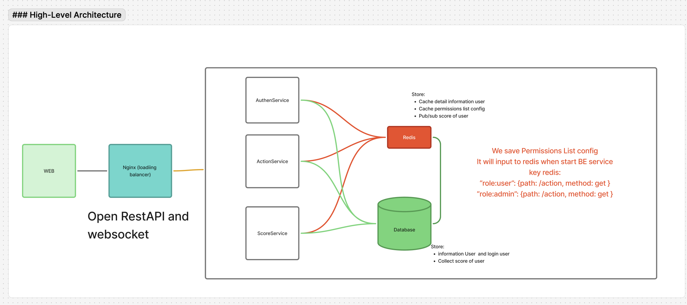

# Live Scoreboard API - Technical Specification

## Table of Contents
1. [System Architecture](#system-architecture)
2. [Authentication & Authorization](#authentication--authorization)

---

## System Architecture
### High-Level Architecture
```
┌─────────────┐
│   Client    │ (Web Browser)
│  (Frontend) │
└──────┬──────┘
       │ HTTP/WebSocket
       │
┌──────▼──────────────────────────────────────────┐
│         Load Balancer (Nginx)                   │
└──────┬──────────────────────────────────────────┘
       │
       ├────────┬────────┬────────┐
       │        │        │        │
┌──────▼───┐ ┌─▼────┐ ┌─▼────┐ ┌─▼────┐
│ API      │ │ API  │ │ API  │ │ API  │
│ Server 1 │ │ Srv2 │ │ Srv3 │ │ SrvN │
└────┬─────┘ └──┬───┘ └──┬───┘ └──┬───┘
     │          │        │        │
     └──────────┴────────┴────────┘
                │
        ┌───────┴───────┐
        │               │
   ┌────▼────┐    ┌─────▼──────┐
   │  Redis  │    │ PostgreSQL │
   │ Cache & │    │ Persistent │
   │ Pub/Sub │    │  Storage   │
   └─────────┘    └────────────┘
```


## Authentication & Authorization
### Authen

### Authorization and Action

### Top 10 user’s scores Dashboard

